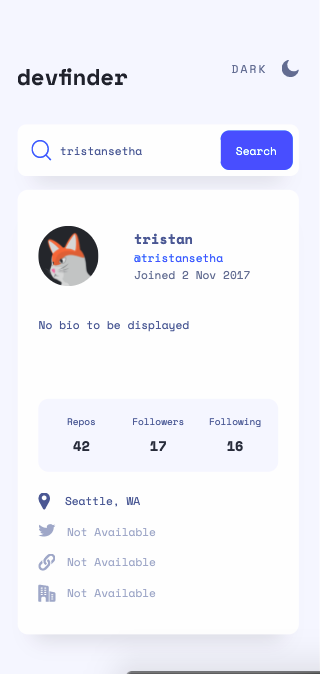
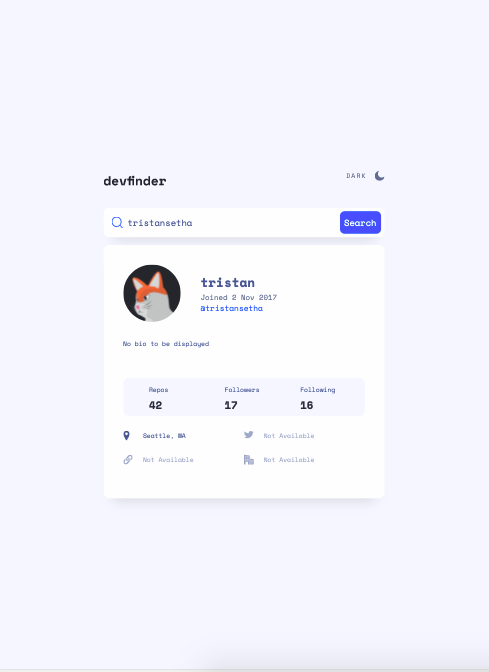
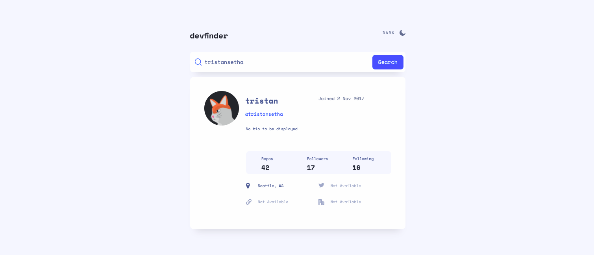
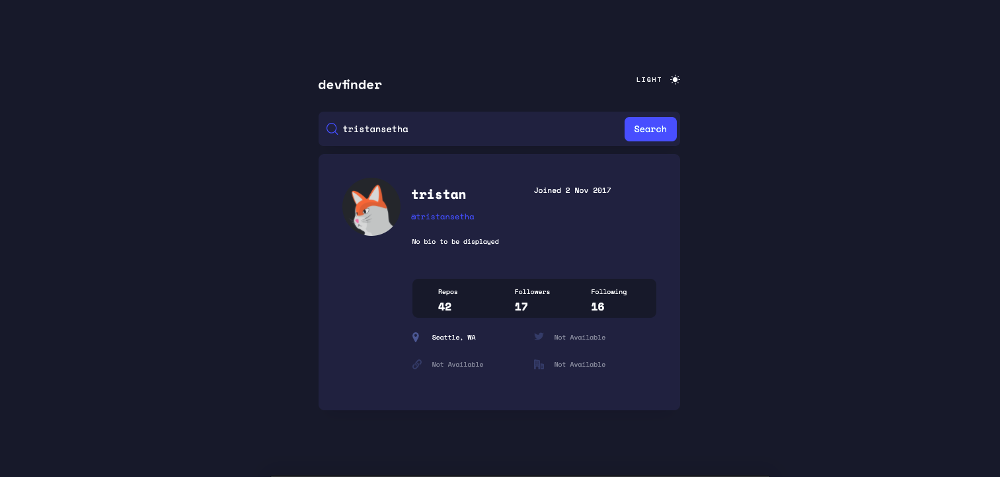

# GitHub user search app solution

## Overview

### The challenge

Users should be able to:

- View the optimal layout for the app depending on their device's screen size
- See hover states for all interactive elements on the page
- Search for GitHub users by their username
- See relevant user information based on their search
- Switch between light and dark themes

### To do
- **Bonus**: Have the correct color scheme chosen for them based on their computer preferences. _Hint_: Research `prefers-color-scheme` in CSS. 
- Error message for searches with no results

### Screenshot

mobile    | tablet |  desktop                   
:-------------------------:|:---:|:-------------------------:
| |  

### Links

- Live Site URL: [Site Link](https://github-user-search-app-cyan.vercel.app/)

## My process

### Built with

- Semantic HTML5 markup
- CSS custom properties
- Flexbox
- CSS Grid
- [React](https://reactjs.org/) - JS library
- [Next.js](https://nextjs.org/) - React framework
- [Styled Components](https://styled-components.com/) - For styles

### What I learned

### Continued development

### Useful resources

- [flex property](https://developer.mozilla.org/en-US/docs/Web/CSS/flex) 

## Author

tristansetha@gmail.com

## Acknowledgments

- [ Contributor sergiodxa ](https://github.com/vercel/swr/issues/254) 
- [ ROB MORIESON ](https://electricanimals.com/articles/next-js-dark-mode-toggle) 

